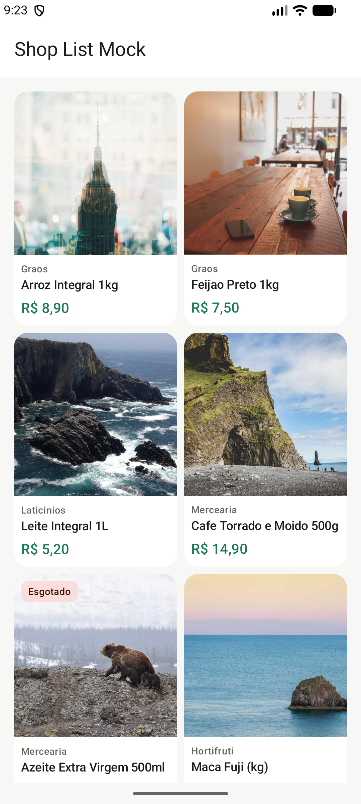
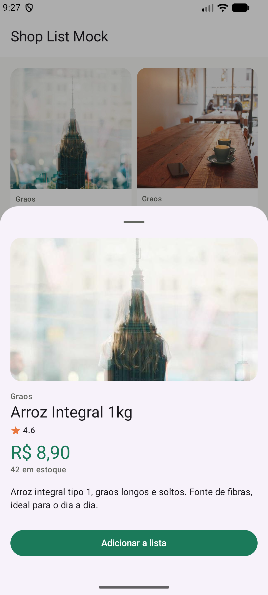
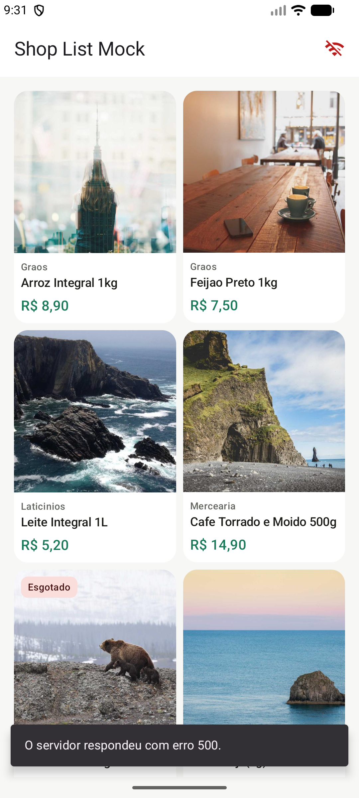

# Shop List Mock

A small product-catalog app built with **Kotlin Multiplatform + Compose Multiplatform**,
targeting Android (built, tested, run on a device) and iOS (the shared module compiles for
`iosArm64`/`iosSimulatorArm64`; no Xcode host was scaffolded from this Windows machine — same
caveat as most of my KMP work).

This repo exists for interviews. The point isn't the app itself — it's showing *how* it was
built: every layer (network -> repository -> use case -> ViewModel/MVI -> UI) landed as its own
branch and pull request, in order, each one buildable and tested on its own. **The commit/PR
history is the actual deliverable** — see the [closed PRs](../../pulls?q=is%3Apr+is%3Aclosed).

| List | Detail | Error state |
| --- | --- | --- |
|  |  |  |

## What it does

- **List** — a two-column grid of a grocery catalog: image, category, name, price (BRL),
  "Esgotado" badge when out of stock, pull-to-retry on error.
- **Detail** — tapping a product opens a bottom sheet with the full description, rating, stock
  and an "Adicionar a lista" action.
- **Live error simulation** — the Wifi icon in the top bar forces every request to fail and
  reloads immediately, so the error path (typed error, snackbar, stale-while-error grid) is
  something you can *watch happen* instead of taking on faith.

## The "mock backend"

There is no real server. `products/data/network/` wires a genuine Ktor `HttpClient` through the
same pipeline a production app would use — content negotiation, kotlinx.serialization, typed
error mapping (`NetworkError`) — but the engine is Ktor's `MockEngine`, which intercepts
requests to `https://api.shoplistmock.dev/v1/...` by URL and answers from local fixtures, with
simulated latency and an injectable error rate (`NetworkSimulationController`, live-tunable —
that's what the top-bar toggle drives).

Swapping the engine for OkHttp/Darwin at the DI boundary (`ProductsModule.kt`) is the only thing
that would change for a real backend; nothing above `ProductApiService` would know the
difference. Product **images**, on the other hand, are genuinely fetched over the network (Coil
+ Ktor, picsum.photos) — only the catalog/product *data* is mocked.

## Architecture

```
shared/src/commonMain/kotlin/com/eykel/shoplistmock/
├── App.kt                      root composable: theme + Coil setup + ProductListScreenRoot
├── core/
│   ├── mvi/Mvi.kt               UiState/UiAction/UiEffect + MviViewModel base
│   ├── result/ModelResult.kt    ModelResult<T> — failures travel as data, not exceptions
│   ├── network/                 NetworkError, NetworkSimulationConfig/Controller
│   ├── format/Currency.kt       manual BRL formatting (no java.text.* — this targets iOS too)
│   ├── ui/ObserveAsEvents.kt    lifecycle-aware one-shot effect collector
│   └── di/                      coreModule + initKoin()
├── designsystem/                colors/theme/spacing + ProductCard, Loading/Error/EmptyState
└── products/
    ├── domain/
    │   ├── model/                Product, ProductDetail
    │   ├── repository/           ProductRepository (interface)
    │   └── usecase/              GetProductsUseCase, GetProductDetailUseCase
    ├── data/
    │   ├── network/               ProductApiService (Ktor + MockEngine), DTOs, fixtures, mappers
    │   └── repository/            ProductRepositoryImpl -> ModelResult
    ├── presentation/
    │   ├── list/                  ProductListContract/ViewModel/Screen
    │   └── detail/                ProductDetailContract/ViewModel + bottom sheet
    └── di/ProductsModule.kt       wires the whole feature through Koin
```

**MVI per screen**: each screen has a `Contract` (`State`/`Action`/`Effect`), a `ViewModel`
extending `MviViewModel`, and a Koin-wired `...Root` composable over a private stateless
composable that previews without Koin. `ProductDetailViewModel` is created per product id via
Koin `parametersOf` — it's never in a state where it doesn't know which product it's showing.

**Error handling**: `ProductRepositoryImpl` never lets a raw exception cross into presentation —
`NetworkError` passes through untouched, anything else is wrapped as `NetworkError.Unknown`, so
a ViewModel only ever pattern-matches on one error type.

## Commands

```bash
./gradlew :androidApp:assembleDebug     # the check that must be green before any commit
./gradlew :shared:testAndroidHostTest   # ViewModel, repository and mock-network-layer tests
```

## Commit history as the point

The task list this repo was built from, one PR each, in order:

1. `chore:` project scaffold (KMP + Compose Multiplatform)
2. `feat:` domain models + mock network layer
3. `feat:` repository layer with typed error handling
4. `feat:` use cases + Koin DI wiring for the data layer
5. `feat:` MVI contract + ViewModel for the product list
6. `feat:` product list screen UI
7. `feat:` MVI contract + ViewModel for the product detail sheet
8. `feat:` product detail bottom sheet UI, wired to the list
9. `feat:` live network-simulation toggle for demoing error states
10. `docs:` this README

Each one is a squash-merged PR from its own branch — the GitHub PR list is the changelog.
